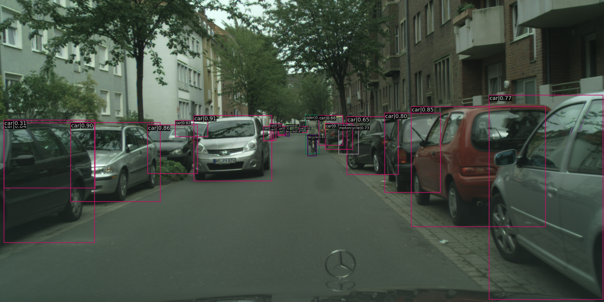
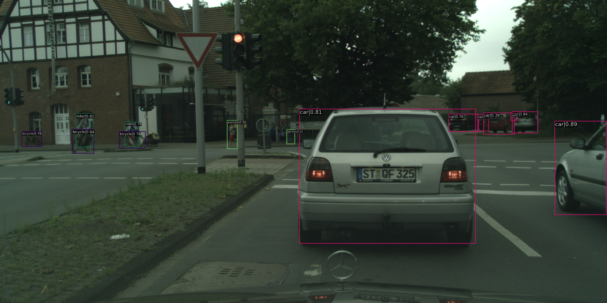
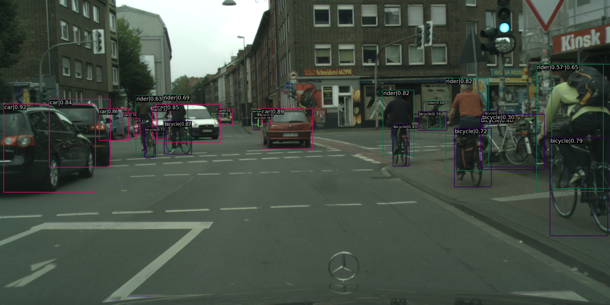
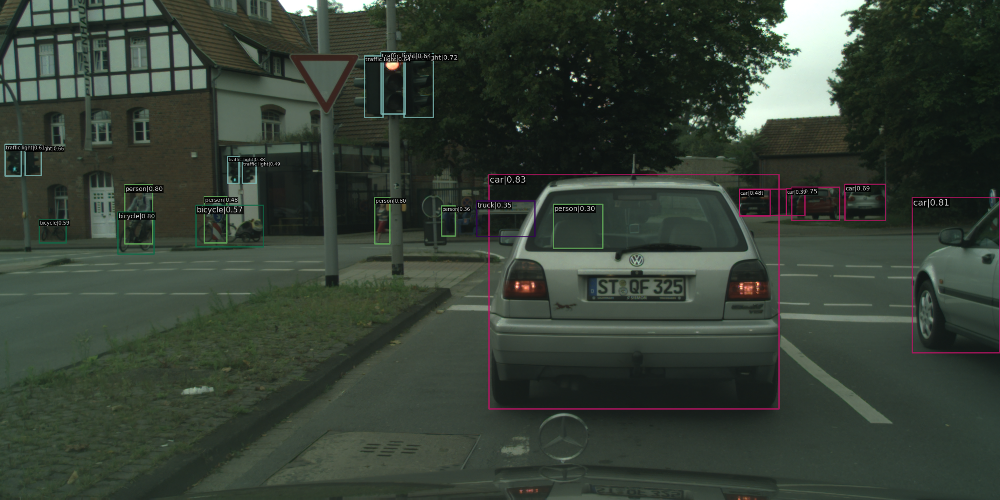

The course project is to apply object detection in Urban Traffic (e.g. detection of cars)

- Tools: PyTorch, mmDetection tool (from OpenMMLab project)
- Data: 
    - Pretrained with [COCO Dataset](https://cocodataset.org/#home): Common Objects in Context
    - Fine-tuning in [Cityscape dataset](https://www.cityscapes-dataset.com)
- Implementation details:
    - [Deformable DETR](https://arxiv.org/abs/2010.04159): Deformable Transformers for End-to-End Object Detection method
- Apply pretrained weights of COCO dataset

## Install [MMdetection](https://github.com/open-mmlab/mmdetection)

Follow https://mmdetection.readthedocs.io/en/stable/get_started.html to install the library.
```
nvidia-smi # check cuda version
conda create --name openmmlab python=3.8 -y
conda activate openmmlab
conda install pytorch torchvision -c pytorch -y
pip install jupyter
pip install -U openmim
mim install mmcv-full
pip install mmdet
```

## Cityscapes data preparation
1. Download Cityscapes Datasets from [link](https://www.cityscapes-dataset.com/downloads/)
2. Download a small test dataset. gtFine_trainvaltest.zip (241MB, ground truth), leftImg8bit_trainvaltest.zip (11GB, raw images)
3. put the data with a specific structure folder according to [link](https://github.com/open-mmlab/mmdetection/blob/ca11860f4f3c3ca2ce8340e2686eeaec05b29111/docs/en/3_exist_data_new_model.md)
    ```
    repo
    ├── mmdet
    ├── tools
    ├── configs
    ├── data
    │   ├── cityscapes
    │   │   ├── annotations
    │   │   ├── leftImg8bit
    │   │   │   ├── train
    │   │   │   ├── val
    │   │   ├── gtFine
    │   │   │   ├── train
    │   │   │   ├── val
    ```
4. MMdet provides a script to convert Citiscapes to COCO annotation format.
    ```
    pip install cityscapesscripts
    python tools/dataset_converters/cityscapes.py ./data/cityscapes --nproc 8 --out-dir ./data/cityscapes/annotations'
    ```
    It generates the ground truth with COCO ground truth format into the folder `data/cityscapes/annotations`

## Download the provided pretrained weight
We use the deformable-detr method. First download the pretrained weight using deformable_detr on COCO2017.
```
mim download mmdet --config deformable_detr_r50_16x2_50e_coco --dest .
```
It should get the config file *deformable_detr_r50_16x2_50e_coco.py* and pretrained checkpoint *deformable_detr_r50_16x2_50e_coco_20210419_220030-a12b9512.pth*.

## Modify the config file for training on Cityscapes.
The new modifed config file is *configs/deformable_detr/deformable_detr_cityscapes.py* which have the dataset folder, change the images scales accroding to cityscapes, and load checkpoint from the pretrained pth file.

## Train
```
python tools/train.py \
    configs/deformable_detr/deformable_detr_cityscapes.py \
    --work-dir logs_ckpt/self-de-detr/
```
With the tensorboard hook on, the training loss/metric figure can be easily checked. It takes around 2 hour to train in a single A100 gpu for one epoch.

Here also try another lighter method with cityscapes config file  which is directly provided by mmdetection. Download the pretrained weight and its config by `mim download mmdet --config faster_rcnn_r50_fpn_1x_coco --dest .`
```
python tools/train.py \
    configs/faster_rcnn/faster_rcnn_r50_fpn_1x_cityscapes.py \
    --work-dir logs_ckpt/faster_rcnn/
```

## Result
|  bbox_mAP | bbox_mAP_50 | bbox_mAP_75 | bbox_mAP_s | bbox_mAP_m | bbox_mAP_l| 
| --- | --- | --- | --- | --- | --- |
| 0.384 | 0.642  |-1.000 | 0.166 | 0.379  |0.600|





## Test with img/imgs
Since cityscapes has a "rider" class which is quite interesting for us. (Since coco doesn't have rider)We picked some pictures with GT label "rider", and compare it with before and after finetuned's model in `test.py`. The trained pth files can be downloded [here](https://kth-my.sharepoint.com/:f:/g/personal/yiya_ug_kth_se/Es6IsXrh1AtAkvIQvAiDtIYBuCrno0URwMHhqR9WOaTY7Q?e=AIaI0X)

Without finetuning


With finetuning


We also try to generate a demo from a video (a sequnce of images) provided by Cityscapes Download *leftImg8bit_demoVideo.zip*. Refer to `test_generate_images_demo.py`.


